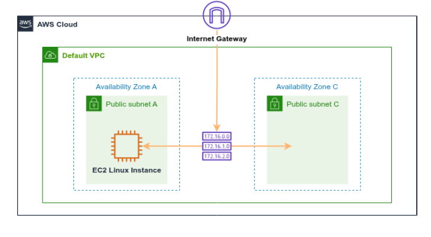

# 1erExamnComputacion
es una practica de como levantar servicios en la nube como EC2, ELB y S3

======================================================================
Instrucciones 

1. Crear un par de claves nuevo
2. Lanzar una instancia de servidor web
3. Conectarse a la instancia de Linux via SSH
4. Crear un EBS con TAGS y asociarlo a la instancia
5. Crear un bucket (S3) con TAGs y subir un archivo .TXT básico
6. Subir las evidencias a su repositorio de GitHub
======================================================================

Arquitectura de la solución sin la S3

